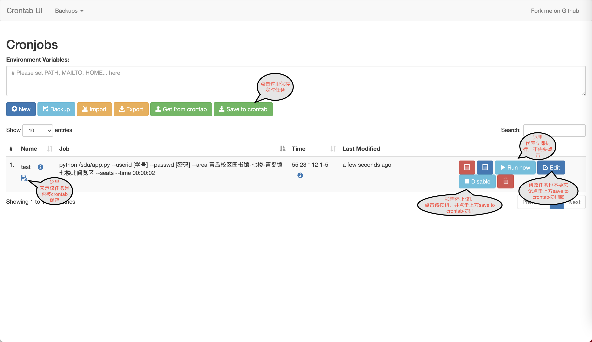

<h2 align="center">SDU-LIB-SEAT</h2>

> 图书馆开放预约时间调整为06:00，目前脚本已经适配，默认06:02:00预约

---

- 项目提供两种使用方式：
    1. 基本的命令行运行
    2. 更简单直观的图形化界面
- 同时项目提供[测试环境](http://101.34.91.143:7000/)
  - 如果要在测试环境中执行脚本，请使用环境变量传递，而不要将密码直接作为参数传递

## 1. 命令行用法

### 下载和安装

```shell
# 注意带参数--recurse-submodules
git clone --recurse-submodules https://github.com/PTYin/sdu-lib-seat.git
# 切换进入项目目录
cd sdu-lib-seat
# 安装python依赖
pip install -r requirements.txt
```

### 运行

- 在当天运行的脚本会在默认00:06:00预约第2天的座位

```shell
cd ./src/main/
python app.py --userid [学号] --passwd [密码] --area [区域] --seats [想要约的座位] --time [脚本约座的时间]  --delta [脚本约座的日期]
```

### 参数说明

| 参数名 |   类型    | 必需  |                             说明                             |
| :----: | :-------: | :---: | :----------------------------------------------------------: |
| userid |    str    | True  |                        山东大学学工号                        |
| passwd |    str    | True  |                   山东大学统一身份认证密码                   |
|  area  |    str    | True  |                    图书馆-楼层-楼层内区域                    |
| seats  | List[str] | False | 想要约的座位，如果列出的座位均已无法约用，或没提供该参数，则在仍没被约用的座位进行约座 |
|  time  |    str    | False | 发起约座的时间，若没提供该参数，则在第二天06:02分开始约后天的位置 |
| retry  |    int    | False | 如果约座失败（网络原因等）重试的次数，默认重试10次，间隔30s  |
| delta  |    int    | False |  约座的日期间隔，0代表今天运行脚本，1代表明天运行脚本，以此类推，默认今天执行 |

- 特别注意area参数要规范，是官网该区域的标题**去掉最后的座位**二字，比如蒋震图书馆-蒋震6楼-D603室从下图中获得


### Example

```shell
cd ./src/main/
python app.py --userid 201805139999 --passwd abc123 --area 青岛校区图书馆-七楼-青岛馆七楼北阅览区 --seats N001 N011 --time 06:02:00  --delta 0
```

## 2. 图形界面管理

- [Crontab-UI](https://github.com/alseambusher/crontab-ui)提供了添加任务、删除任务或暂停任务的图形接口。为了使多人约座，管理约座任务成为可能，在项目中引入Crontab-UI作为管理约座脚本的子模块。
- 具体Crontab-UI的操作见[Crontab-UI](crontab-ui/README.md)
- [测试环境](http://101.34.91.143:7000/)
  - 测试用户：test123
  - 测试密码：test123@sdulib

## 安装

- 由于利用crontab-ui执行脚本山东大学统一身份认证密码会暴露出来
- 推荐自己在服务器上利用docker进行搭建

```shell
  sudo docker build --tag ptyin/crontab-ui:latest .
```

## 运行
```shell
sudo docker run -e BASIC_AUTH_USER=user -e BASIC_AUTH_PWD=yoursecretpassword -d -p 8000:8000 --name crontab-ui ptyin/crontab-ui
```
- 运行之后，会在本地拉起一个端口8000的web服务
- 登陆用户名和密码为你命令提供的环境变量，例子为user和yoursecretpassword

#### 新建任务


#### 编辑任务


#### 邮件提示


#### 保存任务



## 3. 对开发者

- 如果需要运行src/test文件夹下单元测试
    - 需要安装pytest包
    - 需要src/resrc文件夹下有user.json文件，样例：
```json
{
    "username": "张三",
    "userid": "2018XXXXXXXX",
    "passwd": "YourPassword"
}
```
